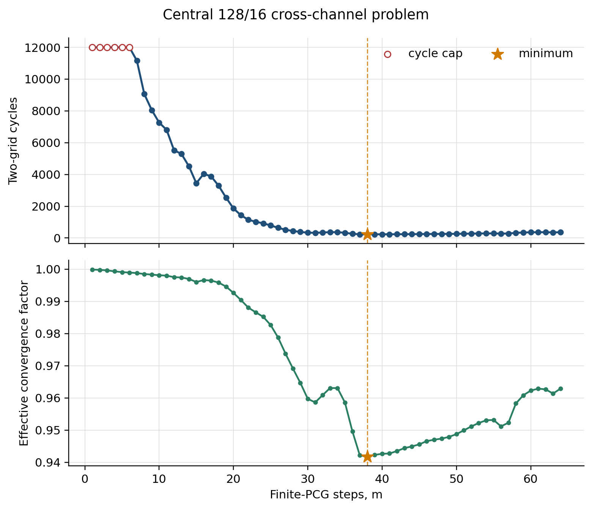

# 多尺度有限 Krylov 能量插值：研究报告 v7.7

## 摘要

本项目研究二维高对比扩散问题中有限 PCG 能量插值的步数选择。核心数值现象是：沿同一
插值构造路径继续迭代并不必然改善两网格求解，适度提前截断反而可显著减少循环数。
据此，项目实现了一个按网格尺度和矩阵对角尺度比选择步数的 adaptive 方法，并通过
尺度、对比度、通道拓扑、参数冻结验证、右端项迁移、停止策略、固定物理场加密和三层
V-cycle 进行检验。主比较的 13 个问题中，adaptive 与 global-reference 均全部收敛，
累计循环数分别为 4459 和 28972；中心问题的逐步扫描在 $m=38$ 取得 231 次循环的最小值，
而数值能量参考需要 3227 次循环。完整理论分析单列于 `theory.tex`。

## 1. 研究问题与方法

考虑单位方形区域上的高对比扩散方程

$$
-\nabla\cdot(a(x)\nabla u)=f,
\qquad u|_{\partial\Omega}=0,
$$

离散后得到对称正定系统 $A_hu_h=b_h$。系数场包括交叉、曲折、对角、平行、分支和
闭合曲环六类高导通道，对比度取 $10^2$、$10^4$ 或 $10^6$。

记每个方向的细、粗网格区间数为 $n=1/h$ 和 $n_H=1/H$，矩阵对角尺度比为
$\chi_A=\max_i A_{ii}/\min_i A_{ii}$。adaptive 选取

$$
m_{\mathrm{ad}}=
\begin{cases}
\operatorname{round}(n/8),&n_H\le 8,\\
\operatorname{round}(n/4),&n_H>8,\ \chi_A<10^3,\\
\operatorname{round}(n/3),&n_H>8,\ 10^3\le\chi_A<10^5,\\
\operatorname{round}(n/2),&n_H>8,\ \chi_A\ge10^5.
\end{cases}
$$

`global-reference` 将各列能量方程推进到相对欧氏残量 $10^{-10}$，作为数值能量参考。
两种方法采用相同粗点、对称 Gauss--Seidel 磨光和 Galerkin 粗算子。

## 2. 实验设置与指标

正式求解均从零初值开始，以相对欧氏残量 $10^{-6}$ 为收敛标准。常规实验的循环上限为
20000；Exp2 为完整扫描控制总成本，使用 12000 的循环上限。有效收敛因子定义为

$$
\rho_{\mathrm{eff}}=
\left(\frac{\lVert r_k\rVert_2}{\lVert r_0\rVert_2}\right)^{1/k},
$$

其中 $k$ 为实际循环数。以下所有循环数均与对应 $\rho_{\mathrm{eff}}$ 配对；因子越小表示
平均每次循环的残量压缩越强。

七个程序按四个主题组织：Exp1--2 给出主比较与中心问题逐步扫描；Exp3--5 检验选择质量、
稳健性、代价和停止策略；Exp6 考察固定物理系数场的嵌套加密；Exp7 给出三层 V-cycle
初步结果。

## 3. 两网格主结果与逐步扫描（Exp1--2）

### 3.1 尺度轴

表中每个性能项均写为“循环数 / 有效收敛因子”。

| $1/h$ | $1/H$ | 拓扑 | adaptive $m$ | adaptive | global-reference |
|---:|---:|---|---:|---:|---:|
| 32 | 8 | cross | 4 | 37 / 0.682669 | 54 / 0.772358 |
| 64 | 8 | cross | 8 | 123 / 0.893149 | 264 / 0.948901 |
| 64 | 16 | cross | 21 | 65 / 0.806080 | 321 / 0.957779 |
| 128 | 16 | cross | 43 | 242 / 0.944407 | 3227 / 0.995727 |
| 256 | 16 | cross | 85 | 998 / 0.986251 | 13948 / 0.999010 |
| 256 | 16 | winding ring | 85 | 1002 / 0.986299 | 3950 / 0.996508 |

### 3.2 对比度轴

| $1/h,1/H$ | 对比度 | adaptive $m$ | adaptive | global-reference |
|---|---:|---:|---:|---:|
| 128, 16 | $10^2$ | 32 | 293 / 0.953841 | 756 / 0.981886 |
| 128, 16 | $10^6$ | 64 | 273 / 0.950536 | 3471 / 0.996027 |

### 3.3 拓扑轴

| $1/h,1/H$ | 拓扑 | adaptive $m$ | adaptive | global-reference |
|---|---|---:|---:|---:|
| 128, 16 | meandering | 43 | 266 / 0.949319 | 759 / 0.981959 |
| 128, 16 | diagonal | 43 | 346 / 0.960851 | 418 / 0.967481 |
| 128, 16 | parallel | 43 | 260 / 0.948151 | 421 / 0.967700 |
| 128, 16 | branching | 43 | 317 / 0.957333 | 615 / 0.977776 |
| 128, 16 | winding ring | 43 | 237 / 0.943169 | 768 / 0.982159 |

两种方法在 13 个问题上均为 13/13 收敛。adaptive 与 global-reference 的累计循环数为
4459 和 28972，后者是前者的 6.50 倍。逐例看，adaptive 在 13 个问题上均减少循环数；
优势从 diagonal topology 的 1.21 倍到 256/16 cross 的 13.98 倍不等。

### 3.4 中心问题的逐步扫描

Exp2 固定 128/16、对比度 $10^4$ 的 cross-channel 问题，对 $m=1,\ldots,64$ 每个整数
步数分别构造两网格循环。完整 64 行数据保存在
`code/results/experiment2_central_step_scan.csv` 和 `experiment2_step_scan.txt`。

| $m$ | 状态 | 循环数 | $\rho_{\mathrm{eff}}$ |
|---:|---|---:|---:|
| 1 | slow-limit | 12000 | 0.9998481 |
| 6 | slow-limit | 12000 | 0.9989233 |
| 7 | converged | 11158 | 0.9987625 |
| 8 | converged | 9058 | 0.9984759 |
| 16 | converged | 4043 | 0.9965883 |
| 24 | converged | 926 | 0.9851882 |
| 31 | converged | 327 | 0.9586121 |
| 32 | converged | 347 | 0.9608744 |
| 36 | converged | 268 | 0.9496447 |
| 37 | converged | 232 | 0.9421552 |
| 38 | converged | 231 | 0.9417637 |
| 40 | converged | 234 | 0.9426292 |
| 43 | converged | 242 | 0.9444069 |
| 48 | converged | 256 | 0.9473433 |
| 56 | converged | 276 | 0.9511605 |
| 64 | converged | 366 | 0.9628552 |

扫描呈现多个局部波动和一个清楚的总体谷值。最小循环数位于 $m=38$，adaptive 选择
$m=43$，多 11 个循环；继续推进到 $m=64$ 后循环数增至 366。global-reference 为
3227 / 0.9957271。因而在该固定问题上，有限步位置、adaptive 位置与能量数值参考三者
具有明确的性能层次。

## 4. 选择质量、稳健性、代价与消融（Exp3--5）

### 4.1 离线采样参考

采样参考在 $m\in[n/8,n/2]$ 的偶数步点中选取循环数最少者。gap 定义为
$100(k_{\mathrm{ad}}-k_{\mathrm{ref}})/k_{\mathrm{ref}}$。

设计组：

| 问题 | adaptive $m$ | adaptive | sampled reference $m$ | sampled reference | gap |
|---|---:|---:|---:|---:|---:|
| 32/8, $10^4$, cross | 4 | 37 / 0.682669 | 4 | 37 / 0.682669 | 0.00% |
| 64/8, $10^4$, cross | 8 | 123 / 0.893149 | 8 | 123 / 0.893149 | 0.00% |
| 64/16, $10^4$, cross | 21 | 65 / 0.806080 | 18 | 54 / 0.772046 | 20.37% |
| 128/16, $10^4$, cross | 43 | 242 / 0.944407 | 38 | 231 / 0.941764 | 4.76% |
| 128/16, $10^2$, cross | 32 | 293 / 0.953841 | 26 | 226 / 0.940525 | 29.65% |
| 128/16, $10^6$, cross | 64 | 273 / 0.950536 | 62 | 263 / 0.948628 | 3.80% |
| 128/16, $10^4$, ring | 43 | 237 / 0.943169 | 52 | 228 / 0.941056 | 3.95% |

冻结参数后的验证组：

| 问题 | adaptive $m$ | adaptive | sampled reference $m$ | sampled reference | gap |
|---|---:|---:|---:|---:|---:|
| 88/11, $10^4$, diagonal | 29 | 278 / 0.951399 | 38 | 243 / 0.944657 | 14.40% |
| 120/15, $10^2$, branching | 30 | 228 / 0.941010 | 18 | 201 / 0.933333 | 13.43% |
| 152/19, $10^6$, parallel | 76 | 367 / 0.962972 | 36 | 238 / 0.943561 | 54.20% |

设计组的平均/最大 gap 为 8.93%/29.65%，验证组为 27.34%/54.20%。这组结果表明单次
选择能够接近离线扫描的较优区域，同时也量化了参数冻结后最困难组合上的剩余差距。

### 4.2 系数 seed 与右端项迁移

五个 seed 的逐例结果：

| seed | adaptive | global-reference |
|---:|---:|---:|
| 1 | 65 / 0.806080 | 321 / 0.957779 |
| 3 | 69 / 0.818544 | 95 / 0.863933 |
| 7 | 57 / 0.784023 | 155 / 0.914620 |
| 11 | 61 / 0.796370 | 182 / 0.926652 |
| 19 | 75 / 0.830459 | 113 / 0.884661 |

两种方法均为 5/5 收敛，累计循环数为 327 和 866。

固定 seed 1 的矩阵与插值后，更换六种右端项：

| RHS | adaptive | global-reference |
|---|---:|---:|
| constant | 65 / 0.806080 | 321 / 0.957779 |
| smooth-low | 76 / 0.832902 | 328 / 0.958659 |
| smooth-mixed | 90 / 0.856965 | 304 / 0.955459 |
| localized-left | 69 / 0.818051 | 42 / 0.715158 |
| localized-right | 84 / 0.847480 | 224 / 0.940172 |
| oscillatory | 85 / 0.849979 | 288 / 0.953140 |

两种方法均为 6/6 收敛，累计循环数为 469 和 1507。adaptive 在五种 RHS 上更快；
localized-left 是唯一由 global-reference 更快的右端项。

### 4.3 平均计时

中心 128/16 问题采用相同机器内、双方预热后各五次、交替顺序测量。表中仅给算术平均值。

| 方法 | setup 平均/ms | solve 平均/ms | total 平均/ms | 循环数 / $\rho_{\mathrm{eff}}$ |
|---|---:|---:|---:|---:|
| adaptive | 358.102 | 165.375 | 523.477 | 242 / 0.944407 |
| global-reference | 1637.871 | 4880.959 | 6518.831 | 3227 / 0.995727 |

在该环境中，global-reference 的平均总时间是 adaptive 的 12.45 倍。时间结果用于同机
端到端比较；循环数和有效因子提供与机器负载无关的补充指标。

### 4.4 停止策略消融

比较 adaptive、统一 $m=\operatorname{round}(n/4)$ 和逐列相对残量 $10^{-2}$ 三种停止
方式。每格仍为“循环数 / 有效收敛因子”。

| 问题 | adaptive | fixed-step | fixed-residual |
|---|---:|---:|---:|
| 32/8, $10^4$, cross | 37 / 0.682669 | 40 / 0.703341 | 54 / 0.773503 |
| 64/16, $10^4$, cross | 65 / 0.806080 | 60 / 0.790885 | 312 / 0.956651 |
| 128/16, $10^2$, cross | 293 / 0.953841 | 293 / 0.953841 | 756 / 0.981879 |
| 128/16, $10^4$, cross | 242 / 0.944407 | 347 / 0.960874 | 3449 / 0.996002 |
| 128/16, $10^6$, cross | 273 / 0.950536 | 20000 slow / 0.999374 | 20000 slow / 0.999985 |
| 128/16, $10^4$, ring | 237 / 0.943169 | 358 / 0.962131 | 1087 / 0.987366 |

adaptive、fixed-step 和 fixed-residual 的收敛数分别为 6/6、5/6 和 5/6，记录循环总数
分别为 1147、21098 和 25658。adaptive 在 5/6 个问题上不劣于 fixed-step，在 6/6 个
问题上不劣于 fixed-residual；64/16 cross 是 fixed-step 略优的唯一算例。

## 5. 固定物理系数场加密（Exp6）

通道宽度固定为 $1/16$，背景分区固定为 $8\times8$，细、粗网格同步二分加密并保持
$H/h=8$。三层共享节点上的系数值失配数为 0。

| $1/h,1/H$ | adaptive $m$ | adaptive | global-reference |
|---|---:|---:|---:|
| 32, 4 | 4 | 122 / 0.892425 | 193 / 0.930748 |
| 64, 8 | 8 | 119 / 0.890129 | 242 / 0.944342 |
| 128, 16 | 43 | 145 / 0.909090 | 151 / 0.912544 |

两种方法在三层上均收敛。adaptive 的优势由前两层的 1.58 和 2.03 倍缩小到最细层的
1.04 倍；该结果说明当前方法在固定物理几何加密上保持稳定，但优势弱于随网格尺度变化
的通道族。

## 6. 三层 V-cycle 初步结果（Exp7）

每个非最粗层独立构造插值，最粗层采用精确稀疏 Cholesky。表中性能项为三层 V-cycle
的“循环数 / 有效收敛因子”。

| 层次 | 拓扑 | adaptive | global-reference |
|---|---|---:|---:|
| 64/16/8 | cross | 101 / 0.870836 | 321 / 0.957873 |
| 128/16/8 | winding ring | 237 / 0.943331 | 770 / 0.982217 |

四个 V-cycle 组合均达到 $10^{-6}$ 容差。adaptive 相对 global-reference 的循环数优势
分别为 3.18 和 3.25 倍；这组结果只承担有限层次可行性验证，不扩展为完整多重网格性能
研究。

## 7. 结论

v7.7 的数值证据支持一个集中结论：在当前高对比通道问题、固定粗点和指定磨光器下，
沿能量插值路径选择有限步位置可以同时降低构造成本和两网格循环数。逐步扫描直接展示
了步数与收敛率的非单调关系；主比较、seed/RHS、停止消融和多层初试说明这一优势并非
由单一算例或单一右端项产生。固定物理场加密中优势明显缩小，因而本文最合适的数值
定位是面向网格尺度通道结构的高对比求解策略，并把固定物理加密作为边界与补充证据。
